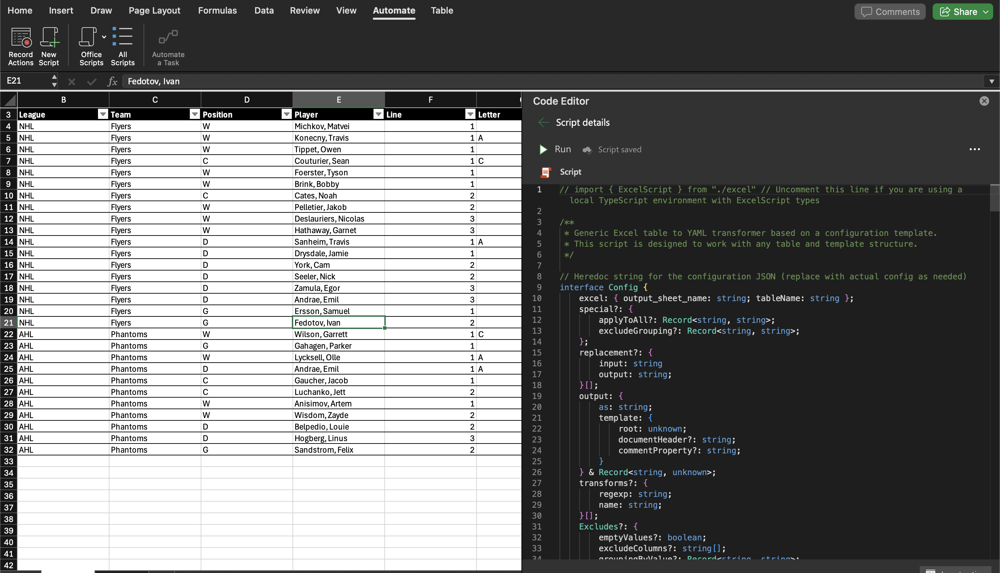
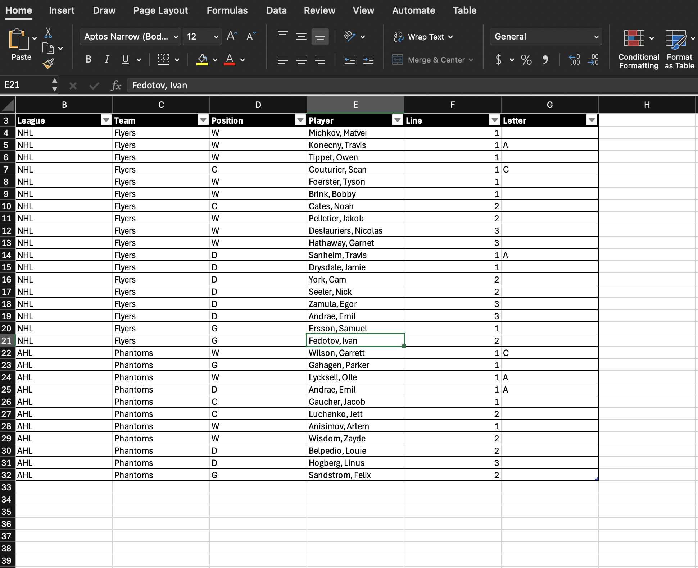
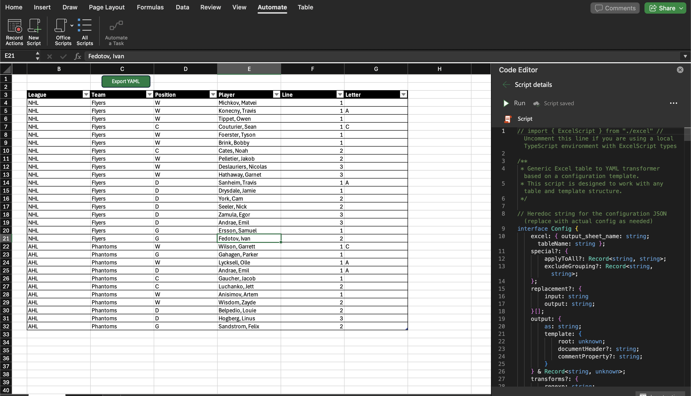

# Excel2YAML

## Overview

Excel2YAML is an Office Script (ExcelScript) for Microsoft Excel that transforms table data into YAML using a flexible template configuration. The script is designed to be pasted as a single file into the Office Scripts editor in Excel Online.

## Usage

1. **Add the Script:**
   - Copy the contents of `Excel2Yaml.ts` into a new Office Script in Excel Online or use it in a local TypeScript environment with the provided `excel.d.ts` for type definitions.
2. **Configure:**
   - Edit the `config` object at the top of the script to match your table name, output sheet, and desired YAML structure.
3. **Run the Script:**
   - Execute the script from the Automate tab in Excel. The YAML output will appear in the specified worksheet.

### How to Add and Use the Script in Excel

Follow these steps to add the Excel2Yaml script to your Excel workbook using Office Scripts in Excel Online:

#### 1. Open the Automate Tab

Go to your Excel workbook in Excel Online. Click on the **Automate** tab in the ribbon at the top.

#### 2. Create a New Script

Click on **New Script** to open the Code Editor.

#### 3. Paste the Script Code

In the Code Editor that appears on the right, paste the contents of `Excel2Yaml.ts`.

#### 4. Save and Name Your Script

Give your script a meaningful name (e.g., `Excel2Yaml`).

#### 5. Prepare Your Table

Make sure your data is formatted as an Excel Table (with headers). You can do this by selecting your data and choosing **Format as Table** from the Home tab.

#### 6. Configure the Script

Edit the `config` object at the top of the script to match your table name, output sheet, and desired YAML structure. See the configuration section above for details.

#### 7. Run the Script

Click the **Run** button in the Code Editor to execute the script, or Add it to the workbook from the 3 dots menu, and use the button. The YAML output will appear in the specified worksheet.

#### 8. Export or Use the YAML Output

You can now copy the YAML output from the output worksheet for use in your application or workflow.

---

For more information on Office Scripts, see the [Office Scripts in Excel documentation](https://learn.microsoft.com/en-us/office/dev/scripts/overview/excel).

## File Structure & Build Process

- `src/interfaces/` — Each interface/type in its own file for robust documentation and maintainability.
- `src/` — All other TypeScript source files, organized modularly (config, functions, main logic, etc).
- `Excel2Yaml.ts` — **Auto-generated single-file script** for Office Scripts. Do not edit directly.
- `excel.d.ts` — Type definitions for ExcelScript. **Never included in the generated Excel2Yaml.ts**; only for local development and type checking.
- `docs/src/` — **Auto-generated markdown documentation** for all interfaces, types, and functions (using TypeDoc or similar).
- `build.js` — Node.js build script to concatenate and inline all code from `src/` into a single file for Office Scripts.
- `typedoc.json` — TypeDoc configuration for markdown documentation.
- `tsconfig.json` — TypeScript config required for documentation generation.
- `package.json` — Project scripts and dependencies.

### Build & Documentation Generation

1. **Build the Office Script:**
   - Run `npm install` to install dev dependencies (TypeDoc and typedoc-plugin-markdown).
   - Run `npm run build` to generate the single-file `Excel2Yaml.ts` for Office Scripts. This will concatenate and inline all code from `src/`, removing all imports/exports and ensuring Office Scripts compatibility (single file, no imports, no external dependencies). **Any file named `excel.d.ts` is always excluded from the build.**

## Build Output

- The build script removes all `namespace Excel2YAML { ... }` wrappers from the final output. Only the inner code is included, with no namespace declaration or braces, even if the namespace wraps a single function.
- All `Excel2YAML.` prefixes are also removed from the output.

2. **Generate Documentation:**
   - Run `npm run docs` to generate markdown documentation for all interfaces, types, and functions in `docs/src/` using TypeDoc.
   - **Note:** The `typedoc-plugin-markdown` plugin and a `tsconfig.json` file are required for markdown output. Both are included in the repo and will be installed or used automatically.

> **Note:** Only `Excel2Yaml.ts` is used in Excel. The `src/` directory is for maintainability, documentation, and development purposes.

## Usage in Excel

1. Copy the contents of the generated `Excel2Yaml.ts` into the Office Scripts editor in Excel Online.
2. Adjust the `config` object at the top of the script to match your table and template needs.
3. Run the script. The YAML output will be written to the specified worksheet.

## Documentation

Detailed documentation is available in the `docs` folder:

- [Features](docs/features.md) - Overview of all features and capabilities
- [Configuration](docs/configuration.md) - Detailed explanation of configuration options
- [Template System](docs/template-system.md) - How to use the template system to define output structure
- [Variables](docs/variables.md) - How to use variables in templates
- [Examples](docs/examples/README.md) - Collection of real-world examples

## Office Scripts Requirements

- The script *must* be a single file.
- The script *must* be written in TypeScript.
- The script *cannot* import any libraries or modules.

## Development Workflow

- Make all code changes in the `src/` directory.
- Each interface/type should be in its own file under `src/interfaces/` for best documentation.
- Run the build process to generate the single-file script for Excel.
- Run the documentation process to update the markdown docs.
- Do not edit `Excel2Yaml.ts` directly; it will be overwritten by the build process.

## License

MIT
